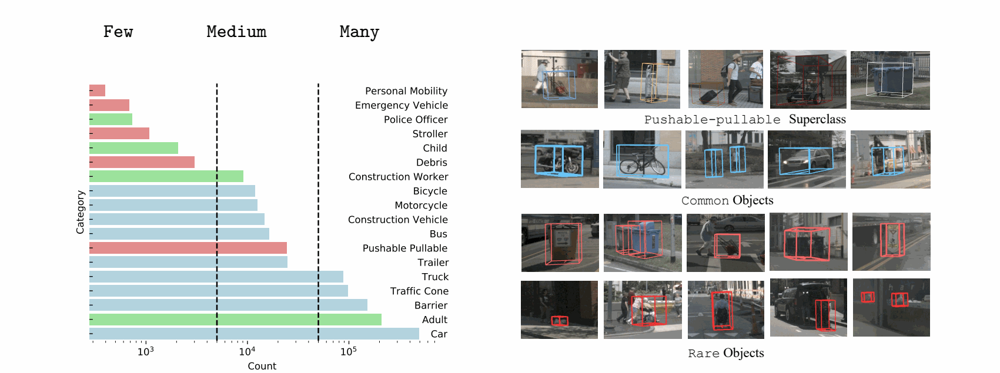
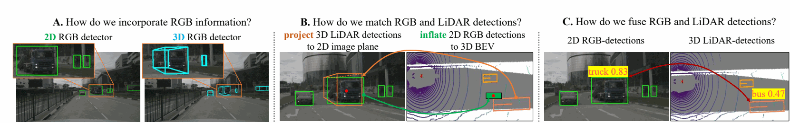
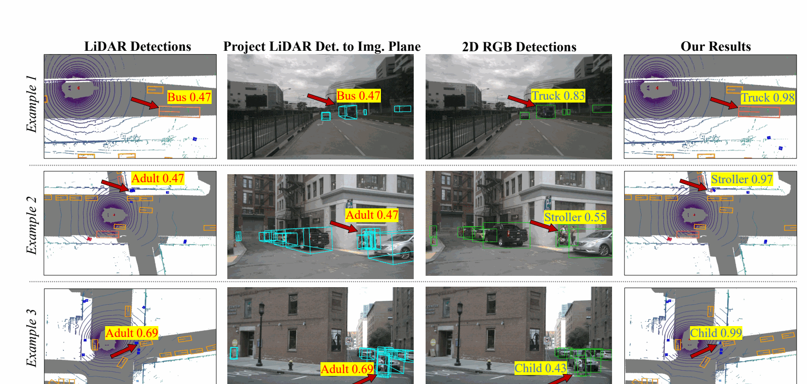

# Long-Tailed 3D Detection via Multi-Modal Late-Fusion

<div align="center">
  <p>
    <strong>Yechi Ma</strong><sup>1,†</sup> &nbsp;
    <strong>Neehar Peri</strong><sup>2,†</sup> &nbsp;
    <strong>Achal Dave</strong><sup>3</sup> &nbsp;
    <strong>Wei Hua</strong><sup>1</sup> &nbsp;
    <strong>Deva Ramanan</strong><sup>4</sup> &nbsp;
    <strong>Shu Kong</strong><sup>5,*</sup>
  </p>
  <p>
    <sup>1</sup>Zhejiang University &nbsp;
    <sup>2</sup>Caltech &nbsp;
    <sup>3</sup>Toyota Research Institute &nbsp;
    <sup>4</sup>Carnegie Mellon University &nbsp;
    <sup>5</sup>University of Macau
  </p>
  <p><sup>†</sup>Equal contribution &nbsp; <sup>*</sup>Corresponding author</p>
  <p>
    <a href="#results">Results</a> |
    <a href="https://drive.google.com/file/d/1AMkLc06Lc34tMeUulnpMAUZGz_stlVzD/view?usp=drivesdk">Qualitative Video</a> |
    <a href="#released-artifacts">Released Artifacts</a>
  </p>
</div>

<p align="center">
  
</p>

Autonomous-driving datasets contain a naturally long-tailed distribution of
objects. Standard benchmarks emphasize frequent categories while overlooking
rare but safety-critical classes such as `child`, `stroller`,
`emergency_vehicle`, and `police_officer`. LT3D evaluates all 18 annotated
nuScenes classes and reports performance over Many, Medium, and Few splits.

## Abstract

Contemporary autonomous vehicle benchmarks have significantly advanced
multimodal LiDAR and RGB 3D detection. However, despite the naturally
long-tailed distribution of object classes, existing benchmarking protocols
primarily focus on a small set of frequent categories, largely overlooking
rare but safety-critical classes. We formalize this problem as Long-Tailed 3D
Detection (LT3D), where evaluation encompasses all annotated classes. We
introduce hierarchical losses that promote feature sharing across classes,
diagnostic metrics that assign partial credit to semantically reasonable
mistakes with respect to the semantic hierarchy, and a Multi-Modal Late-Fusion
(MMLF) framework. MMLF combines independently trained LiDAR and RGB detectors,
allowing advanced unimodal models and additional unimodal data to be used
without paired LiDAR-RGB training. We examine three fundamental design choices:
the RGB detector representation, cross-modal association space, and fusion
strategy. Our experiments show that 2D RGB detectors recognize rare classes
more reliably than monocular 3D detectors, image-plane association is robust to
depth errors, and probabilistic fusion of calibrated scores provides the best
performance. Experiments on nuScenes and Argoverse 2 establish a new state of
the art for LT3D.

## Method

MMLF is a modular, non-learned late-fusion framework. A LiDAR detector provides
accurate 3D localization, while a 2D RGB detector supplies stronger semantic
recognition for visually distinctive long-tail objects.

<p align="center">
  
</p>

The final design uses:

- a strong **2D RGB detector** rather than a monocular 3D RGB detector;
- **image-plane association** between projected LiDAR boxes and 2D detections;
- **score calibration and probabilistic fusion** for matched detections;
- class-relaxed matching and semantic relabeling for related categories;

This architecture is detector-agnostic: stronger unimodal detectors can be
adopted without retraining a joint multimodal network.

## Results

### nuScenes LT3D benchmark

| Method | Modality | All mAP | Many | Medium | Few |
|---|:---:|---:|---:|---:|---:|
| CenterPoint | L | 39.2 | 76.4 | 43.1 | 3.5 |
| CMT | C+L | 44.4 | 79.9 | 53.0 | 4.8 |
| CCF | C+L | 47.1 | 79.8 | 56.2 | 9.2 |
| FOMO-3D | C+L | 54.6 | 79.9 | 59.6 | 27.6 |
| **MMLF (CenterPoint + Co-DINO)** | **C+L** | **57.0** | **80.7** | **64.0** | **29.2** |

The released best prediction achieves **57.04 mAP** and **62.81 NDS**. Values
in the comparison table are rounded to one decimal place, following the paper.

### Released long-tail breakdown

| Split | Classes | Mean LCA0 AP |
|---|---|---:|
| Many | car, truck, adult, traffic_cone, barrier | 80.74 |
| Medium | trailer, bus, construction_vehicle, bicycle, motorcycle, construction_worker, pushable_pullable | 63.96 |
| Few | emergency_vehicle, child, police_officer, stroller, personal_mobility, debris | 29.21 |

Detailed per-class, distance, and LiDAR-density results are available in
[`docs/results.md`](docs/results.md).

## Qualitative Results

MMLF uses RGB evidence to correct semantically plausible LiDAR mistakes such as
`bus` to `truck`, `adult` to `stroller`, and `adult` to `child`, while retaining
the LiDAR detector's 3D localization.

<p align="center">
  
</p>

The [qualitative comparison video](https://drive.google.com/file/d/1AMkLc06Lc34tMeUulnpMAUZGz_stlVzD/view?usp=drivesdk)
shows continuous-frame comparisons among MMLF, CMT, and CCF with highlighted
long-tail improvements.

## Released Artifacts

Large predictions and camera detections are hosted separately:

- Final 3D predictions: [part 1](https://drive.google.com/file/d/1ZHD2JIQzZpFG9cwTNrm8kUPSVUBW_z_z/view?usp=drivesdk), [part 2](https://drive.google.com/file/d/1_Wxu0Mq3L1Hjp3vd0_wedgJuVTlOrARa/view?usp=drivesdk), [part 3](https://drive.google.com/file/d/19Cv8Bd2XLfeXlWAbx8Pu25FMk3alM9z-/view?usp=drivesdk)
- Camera detection results: [lt3d_lf_camera_results.tar.gz](https://drive.google.com/file/d/1NGMGuB7detRJkiHy8hbXvok6rJ2PfLUU/view?usp=drivesdk)
- Evaluation summary: [lt3d_lf_evaluation_summary.tar.gz](https://drive.google.com/file/d/1Eq27aE-nJlVLYtpO5Mo0bJUip_7O6KRW/view?usp=drivesdk)
- Qualitative video: [lt3d_lf_qualitative_comparison.mp4](https://drive.google.com/file/d/1AMkLc06Lc34tMeUulnpMAUZGz_stlVzD/view?usp=drivesdk)

Reconstruct the final prediction file on Linux or macOS:

```bash
cat lt3d_lf_final_3d_predictions.json.gz.part* > lt3d_lf_final_3d_predictions.json.gz
```

On Windows:

```bat
copy /b lt3d_lf_final_3d_predictions.json.gz.part001+lt3d_lf_final_3d_predictions.json.gz.part002+lt3d_lf_final_3d_predictions.json.gz.part003 lt3d_lf_final_3d_predictions.json.gz
```

## Repository Layout

```text
lt3d_lf/                 Core fusion, calibration, evaluation, and metrics code
analysis/                Stratified LT3D LCA0 AP analysis
configs/                 Final fusion parameters and threshold maps
scripts/                 Final fusion run script
docs/                    Detailed result tables
assets/                  Paper figures used in this README
```

## Environment

The code is intended to run inside an existing MMDetection3D and
nuScenes-LT3D environment. For long-tail 18-class evaluation, clone both LT3D
repositories:

```bash
git clone https://github.com/neeharperi/LT3D
git clone https://github.com/neeharperi/nuscenes-lt3d.git
export LT3D_NUSCENES_SDK=/path/to/nuscenes-lt3d/python-sdk
```

The `nuscenes-lt3d` SDK provides the LT3D detection configurations used by
`python main.py evaluate`, while the LT3D repository contains the benchmark
definition and related resources. When multiple `nuscenes-devkit` versions are
installed, set `LT3D_NUSCENES_SDK` or pass `--nuscenes-sdk` so the LT3D SDK is
imported first.

Install the lightweight Python dependencies:

```bash
pip install -r requirements.txt
```

MMDetection3D, MMCV, CUDA, and the LT3D evaluation SDK should follow the
versions used by the detector environment.

## Run Fusion and Evaluation

Edit the paths in `scripts/run_final_fusion.sh`, then run:

```bash
bash scripts/run_final_fusion.sh
```

Equivalent command:

```bash
python main.py fuse \
  --lidar-predictions /path/to/lidar_predictions.pkl \
  --camera-results /path/to/camera_results/s015 \
  --calibration-json /path/to/calibration.json \
  --score-2d-threshold 0.15 \
  --score-3d-threshold 0.10 \
  --score-3d-threshold-json configs/final_lidar_threshold_map.json \
  --match-mode class_relaxed \
  --mismatch-policy relabel \
  --rescue-score-json configs/final_rescue_score_map.json \
  --adult-child-relaxed
```

Evaluate an existing result JSON without rerunning fusion:

```bash
python main.py evaluate --result-json /path/to/results_nusc.json
```
